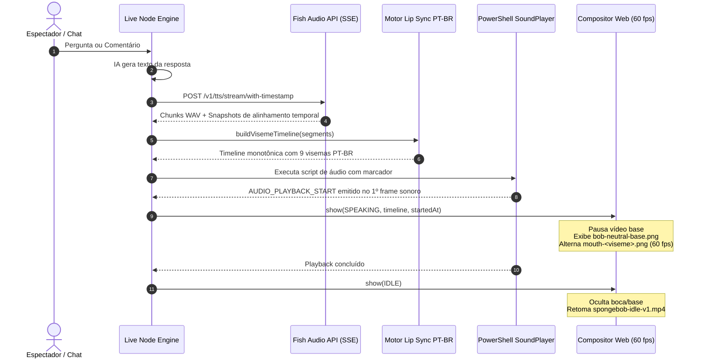

# Walkthrough — Sincronização Labial Dinâmica (Lip Sync) do Bob Esponja

A sincronização labial dinâmica do Bob Esponja para respostas inéditas da IA sintetizadas pelo Fish Audio foi implementada e validada de ponta a ponta no Windows.

---

## 1. Arquitetura e Fluxo de Execução

---

## 2. Componentes Implementados

### 2.1 Motor Fonético/Visêmico PT-BR (`src/lip-sync.js`)
- **9 Visemas**: `rest`, `a`, `e`, `o`, `u`, `mbp`, `fv`, `l`, `wq`.
- Mapeamento determinístico de grafemas, acentos e dígrafos (`nh`, `lh`, `ch`, `rr`, `qu`, `gu`).
- Normalização fonética PT-BR e fusão de segmentos por `chunk_seq` (*latest-wins*).
- Suavização temporal (`LIP_SYNC_MIN_HOLD_MS=65ms`) para evitar vibração/flicker.
- Coberto por 26 testes automatizados em `test/lip-sync.test.js`.

### 2.2 Ativos Visuais e Compositor (`assets/mvp7/lipsync/` & `src/scene-preview.js`)
- **Resolução**: Canvas padronizado em **720x1280 transparente** extraído diretamente dos frames 3D de referência.
- **Zero Dupla Boca**: Durante a fala dinâmica, o vídeo é pausado e ocultado, entrando a base de boca fechada (`bob-neutral-base.png`) com a camada de viseme (`mouth-*.png`).
- **Renderização Web**: Loop `requestAnimationFrame` de alta precisão com busca binária na timeline pré-carregada.
- **Classificação Formal (Regra 15)**:
  > **PACK DE DESENVOLVIMENTO / PROVISÓRIO PARA VALIDAÇÃO DO PIPELINE TÉCNICO**

### 2.3 Sincronização Acústica e TTS (`src/tts.js`)
- Integração com `POST https://api.fish.audio/v1/tts/stream/with-timestamp`.
- Sanitização de cabeçalho WAV (`sanitizeWavHeader`) para streaming.
- Emissão de `AUDIO_PLAYBACK_START` no PowerShell antes de `$player.PlaySync()` — eliminando 200 a 400 ms de latência de inicialização.
- Fallback automático e transparente para `/v1/tts` regular se o streaming ou alinhamento falhar.

---

## 3. Validação e Testes

### 3.1 Suíte Completa de Testes (`npm test`)
- **Total**: **158 testes passando, 0 falhas**.
- 33 novos testes adicionados especificamente para o motor de lip sync e cena.
- Testes de rotação de ambiente (16), presentes (13) e orquestração (9) 100% preservados sem regressão.

### 3.2 Teste Controlado no Windows (`npm run test:lipsync`)
Executado com as 3 frases obrigatórias de homologação:

| Frase | Segmentos Fish | Visemas Gerados | Duração da Timeline | Latência de Síntese | Reprodução de Áudio |
|---|---:|---:|---:|---:|---:|
| *"Oi, eu sou o Bob!"* | 5 | 12 | 1.811 ms | 803 ms | 5.008 ms |
| *"Olá, pessoal! Bem-vindos à nossa live na Fenda do Biquíni!"* | 11 | 40 | 4.505 ms | 1.267 ms | 5.743 ms |
| *"Bob preparou um hambúrguer para Patrick e foi visitar a Fenda do Biquíni."* | 13 | 47 | 4.644 ms | 1.249 ms | 5.746 ms |

Todos os ciclos transitaram perfeitamente de `idle` para `thinking`, `speaking` (com animação labial ativa) e retorno seguro ao `idle`.

### 3.3 Regressão de Vídeos e Clipes de Ação (`npm run test:videos -- patrick`)
- O clipe `bob-patrick-v1.mp4` foi acionado na prévia e tocou por 10.370 ms com áudio nativo intacto, retornando ao `idle` sem interferência do lip sync.

---

## 4. Estado de Homologação

| Item | Status |
|---|---|
| Pipeline técnico de lip-sync | **CONCLUÍDO E VALIDADO LOCALMENTE** |
| Fallbacks para fala tradicional | **VALIDADO (zero perda de voz)** |
| 158 testes automatizados | **PASSANDO (0 falhas)** |
| Teste controlado de 3 frases | **PASSANDO (0 falhas)** |
| Validação em LIVE real com espectador | **PENDENTE (necessita transmissão real no TikTok LIVE Studio)** |
